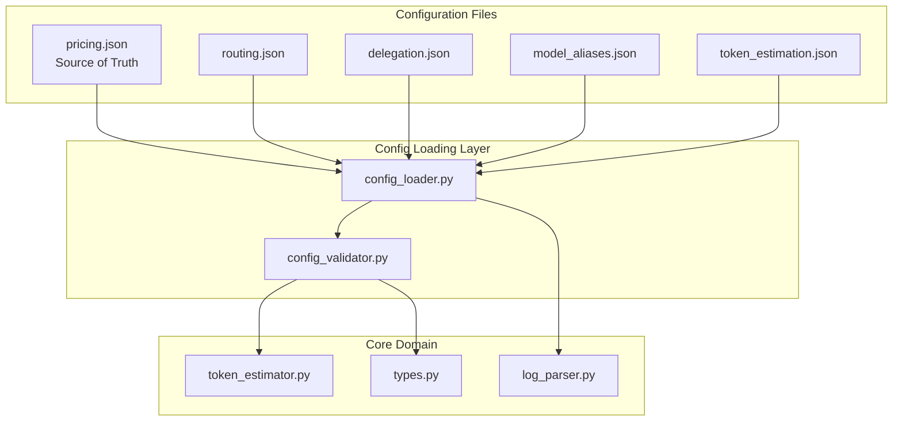
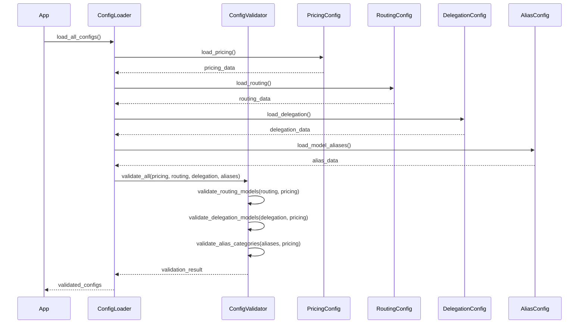

# Design Document: Dynamic Model Configuration

## Overview

This design refactors the Multi-Model LLM Cost Predictor to replace the hardcoded `ModelName` enum with a configuration-driven approach. Models will be defined in JSON configuration files, with `pricing.json` serving as the source of truth for valid models. New configuration files (`routing.json`, `delegation.json`, `model_aliases.json`) will define routing rules, delegation behavior, and model category mappings.

The key architectural change is moving from compile-time model definitions (Python enums) to runtime model definitions (JSON configuration). This enables adding, removing, or renaming models without code changes.

## Architecture



### Configuration Loading Flow



## Components and Interfaces

### 1. Configuration File Schemas

#### pricing.json (Existing - Modified)
```json
{
  "models": {
    "<model_name>": {
      "input": <float>,
      "output": <float>
    }
  }
}
```
- No longer restricted to fixed model names
- Any model defined here is considered valid

#### routing.json (New)
```json
{
  "classifier_model": "<model_name>",
  "query_type_routes": {
    "visual": "<model_name>",
    "code": "<model_name>",
    "research": "<model_name>"
  }
}
```

#### delegation.json (New)
```json
{
  "rules": {
    "<source_model>": {
      "<query_type>": "<target_model>"
    }
  }
}
```

#### model_aliases.json (New)
```json
{
  "categories": {
    "<CATEGORY_NAME>": ["<actual_model_1>", "<actual_model_2>"]
  }
}
```

### 2. Config Loader Interface

```python
# config_loader.py additions

def load_routing() -> Dict[str, Any]:
    """
    Load routing configuration from config/routing.json.
    
    Returns:
        Dictionary with classifier_model and query_type_routes
    
    Raises:
        FileNotFoundError: If routing.json doesn't exist
        ConfigValidationError: If routing config is invalid
    """
    pass

def load_delegation() -> Dict[str, Any]:
    """
    Load delegation configuration from config/delegation.json.
    
    Returns:
        Dictionary with delegation rules
    
    Raises:
        FileNotFoundError: If delegation.json doesn't exist
        ConfigValidationError: If delegation config is invalid
    """
    pass

def load_model_aliases() -> Dict[str, Any]:
    """
    Load model alias configuration from config/model_aliases.json.
    
    Returns:
        Dictionary with category-to-models mapping
    
    Raises:
        FileNotFoundError: If model_aliases.json doesn't exist
        ConfigValidationError: If alias config is invalid
    """
    pass

def get_valid_models(pricing_config: Dict[str, Any]) -> set[str]:
    """
    Extract set of valid model names from pricing configuration.
    
    Args:
        pricing_config: Loaded pricing configuration
    
    Returns:
        Set of valid model name strings
    """
    pass
```

### 3. Config Validator Interface

```python
# config_validator.py additions

def validate_routing_config(
    config: Dict[str, Any], 
    valid_models: set[str]
) -> List[str]:
    """
    Validate routing configuration against valid models.
    
    Args:
        config: Routing configuration dictionary
        valid_models: Set of valid model names from pricing config
    
    Returns:
        List of validation error messages (empty if valid)
    """
    pass

def validate_delegation_config(
    config: Dict[str, Any], 
    valid_models: set[str]
) -> List[str]:
    """
    Validate delegation configuration against valid models.
    
    Args:
        config: Delegation configuration dictionary
        valid_models: Set of valid model names from pricing config
    
    Returns:
        List of validation error messages (empty if valid)
    """
    pass

def validate_model_aliases_config(
    config: Dict[str, Any], 
    valid_models: set[str]
) -> List[str]:
    """
    Validate model aliases configuration against valid models.
    
    Args:
        config: Model aliases configuration dictionary
        valid_models: Set of valid model names from pricing config
    
    Returns:
        List of validation error messages (empty if valid)
    """
    pass
```

### 4. Types Module Changes

```python
# types.py - REMOVE ModelName enum

# KEEP these enums (domain concepts, not configurable)
class QueryType(Enum):
    VISUAL = "visual"
    CODE = "code"
    RESEARCH = "research"

class Complexity(Enum):
    SIMPLE = "simple"
    MEDIUM = "medium"
    COMPLEX = "complex"

# MODIFY CostBreakdown - no changes needed as it doesn't use ModelName directly
@dataclass
class CostBreakdown:
    routing_cost: float
    lead_cost: float
    delegation_cost: float
    total_cost: float
    query_type: QueryType
    complexity: Complexity
    was_routed_correctly: bool
    num_delegations: int
```

### 5. Token Estimator Changes

```python
# token_estimator.py modifications

class TokenEstimator:
    def estimate_input_tokens(
        self,
        query_type: QueryType,
        complexity: Complexity,
        model: str,  # Changed from ModelName to str
        rng: np.random.Generator
    ) -> int:
        """Model parameter now accepts string model names."""
        pass
    
    def estimate_total_tokens(
        self,
        query_type: QueryType,
        complexity: Complexity,
        model: str,  # Changed from ModelName to str
        is_correct_model: bool,
        rng: np.random.Generator
    ) -> Tuple[int, int]:
        """Model parameter now accepts string model names."""
        pass
    
    def estimate_delegation_tokens(
        self,
        query_type: QueryType,
        complexity: Complexity,
        tool_model: str,  # Changed from ModelName to str
        original_input_tokens: int,
        rng: np.random.Generator
    ) -> Tuple[int, int, int, int]:
        """Tool model parameter now accepts string model names."""
        pass
```

### 6. Model Alias Resolution

```python
# New utility function in config_loader.py or new module

def resolve_model_to_category(
    model_name: str, 
    aliases_config: Dict[str, Any]
) -> str | None:
    """
    Resolve an actual model name to its category.
    
    Args:
        model_name: Actual model name (e.g., "grok-4-1-fast")
        aliases_config: Loaded model aliases configuration
    
    Returns:
        Category name if found, None otherwise
    """
    for category, models in aliases_config.get("categories", {}).items():
        if model_name in models:
            return category
    return None

def resolve_category_to_models(
    category: str, 
    aliases_config: Dict[str, Any]
) -> List[str]:
    """
    Get all model names for a category.
    
    Args:
        category: Category name (e.g., "GROK")
        aliases_config: Loaded model aliases configuration
    
    Returns:
        List of model names in the category
    """
    return aliases_config.get("categories", {}).get(category, [])
```

## Data Models

### Configuration Data Structures

```python
from typing import TypedDict, Dict, List

class ModelPricing(TypedDict):
    input: float
    output: float

class PricingConfig(TypedDict):
    models: Dict[str, ModelPricing]

class RoutingConfig(TypedDict):
    classifier_model: str
    query_type_routes: Dict[str, str]  # query_type -> model_name

class DelegationRules(TypedDict):
    rules: Dict[str, Dict[str, str]]  # source_model -> {query_type -> target_model}

class ModelAliasesConfig(TypedDict):
    categories: Dict[str, List[str]]  # category -> [model_names]
```

### Example Configuration Files

#### config/routing.json
```json
{
  "classifier_model": "classifier",
  "query_type_routes": {
    "visual": "gemini",
    "code": "coder",
    "research": "grok"
  }
}
```

#### config/delegation.json
```json
{
  "rules": {
    "gemini": {
      "code": "coder",
      "research": "grok"
    },
    "coder": {
      "research": "grok"
    },
    "grok": {
      "code": "coder"
    }
  }
}
```

#### config/model_aliases.json
```json
{
  "categories": {
    "GEMINI": ["gemini-3-flash-preview", "gemini-pro", "gemini-ultra"],
    "CODER": ["coder-v1", "qwen-coder"],
    "GROK": ["grok-4-1-fast", "grok-4-1"],
    "CLASSIFIER": ["classifier-v1"]
  }
}
```

## Correctness Properties

*A property is a characteristic or behavior that should hold true across all valid executions of a system—essentially, a formal statement about what the system should do. Properties serve as the bridge between human-readable specifications and machine-verifiable correctness guarantees.*

### Property 1: Configuration Loading Round-Trip

*For any* valid configuration file (routing, delegation, or aliases), loading the file and then accessing its fields should return the exact same data that was written to the file.

**Validates: Requirements 2.1, 2.2, 2.3, 3.1, 3.2, 5.1, 5.2**

### Property 2: Model Validation Against Pricing

*For any* model name string referenced in routing config, delegation config, or alias config, validation should pass if and only if that model exists in the pricing config's models object.

**Validates: Requirements 1.4, 2.4, 3.3, 3.4, 4.2, 4.3, 4.4, 4.5, 5.5**

### Property 3: Query Type Validation

*For any* query type string referenced in routing config or delegation config, validation should pass if and only if that string matches one of the valid QueryType enum values ("visual", "code", "research").

**Validates: Requirements 2.5, 3.5**

### Property 4: Log Parsing with Arbitrary Model Strings

*For any* valid log entry containing arbitrary string values for model_used, routed_to, and delegation_chain fields, the log parser should successfully parse the entry without requiring model names to match any predefined set.

**Validates: Requirements 7.1, 7.2, 7.3, 7.4**

### Property 5: Token Estimation with String Models

*For any* model name string that exists in the token estimation config's system_prompts, the TokenEstimator should successfully estimate tokens using that model name as a string parameter.

**Validates: Requirements 1.3, 8.1, 8.2**

### Property 6: Token Estimation Error for Unknown Models

*For any* model name string that does not exist in the token estimation config's system_prompts, the TokenEstimator should raise a descriptive error.

**Validates: Requirements 8.3**

### Property 7: Validation Error Collection

*For any* configuration with multiple validation errors, the validator should return all errors in a single response rather than failing on the first error encountered.

**Validates: Requirements 6.5**

### Property 8: Model-to-Category Resolution

*For any* model name that appears in any category list in the alias config, resolving that model name to a category should return the category it belongs to.

**Validates: Requirements 5.3**

## Error Handling

### Configuration Loading Errors

| Error Condition | Error Type | Message Format |
|----------------|------------|----------------|
| Config file not found | `FileNotFoundError` | "Configuration file not found: {filepath}" |
| Invalid JSON syntax | `json.JSONDecodeError` | "Error parsing JSON file {filepath}: {details}" |
| Missing required field | `ConfigValidationError` | "Missing required field: {field_name}" |
| Invalid model reference | `ConfigValidationError` | "Model '{model}' in {config_type} not found in pricing config" |
| Invalid query type | `ConfigValidationError` | "Invalid query type '{query_type}' in {config_type}. Must be one of: visual, code, research" |

### Token Estimation Errors

| Error Condition | Error Type | Message Format |
|----------------|------------|----------------|
| Unknown model | `KeyError` or custom error | "Model '{model}' not found in token estimation config" |

### Validation Error Aggregation

The validator collects all errors before returning:

```python
def validate_routing_config(config: Dict, valid_models: set[str]) -> List[str]:
    errors = []
    
    # Check classifier model
    if config.get("classifier_model") not in valid_models:
        errors.append(f"classifier_model '{config.get('classifier_model')}' not in pricing config")
    
    # Check all route targets
    for query_type, model in config.get("query_type_routes", {}).items():
        if query_type not in {"visual", "code", "research"}:
            errors.append(f"Invalid query type '{query_type}'")
        if model not in valid_models:
            errors.append(f"Route target '{model}' for '{query_type}' not in pricing config")
    
    return errors  # Returns ALL errors, not just first
```

## Testing Strategy

### Dual Testing Approach

This feature requires both unit tests and property-based tests:

- **Unit tests**: Verify specific examples, edge cases, and error conditions
- **Property tests**: Verify universal properties across randomly generated inputs

### Property-Based Testing Configuration

- **Library**: Hypothesis (already used in the project)
- **Minimum iterations**: 100 per property test
- **Tag format**: `**Feature: dynamic-model-config, Property {number}: {property_text}**`

### Test Categories

#### Unit Tests
- Loading each config file type with valid data
- Loading config files with missing required fields
- Validation error messages are descriptive
- Token estimator works with known model names
- Model alias resolution for known models

#### Property Tests

1. **Configuration Loading Round-Trip** (Property 1)
   - Generate random valid config structures
   - Write to temp file, load, verify all fields match

2. **Model Validation Against Pricing** (Property 2)
   - Generate random pricing configs with various models
   - Generate routing/delegation/alias configs referencing those models
   - Verify validation passes for valid references, fails for invalid

3. **Query Type Validation** (Property 3)
   - Generate configs with random query type strings
   - Verify only "visual", "code", "research" pass validation

4. **Log Parsing with Arbitrary Strings** (Property 4)
   - Generate log entries with random string model names
   - Verify parsing succeeds regardless of model name content

5. **Token Estimation with String Models** (Property 5)
   - Generate token configs with random model names
   - Verify estimation works for any model in config

6. **Token Estimation Error for Unknown Models** (Property 6)
   - Generate token configs and request estimation for models not in config
   - Verify appropriate error is raised

7. **Validation Error Collection** (Property 7)
   - Generate configs with multiple intentional errors
   - Verify all errors are returned in single response

8. **Model-to-Category Resolution** (Property 8)
   - Generate alias configs with random categories and models
   - Verify resolution returns correct category for each model

### Generator Strategies

```python
@st.composite
def valid_routing_config(draw, valid_models: List[str]):
    """Generate valid routing config using models from provided list."""
    return {
        "classifier_model": draw(st.sampled_from(valid_models)),
        "query_type_routes": {
            "visual": draw(st.sampled_from(valid_models)),
            "code": draw(st.sampled_from(valid_models)),
            "research": draw(st.sampled_from(valid_models))
        }
    }

@st.composite  
def valid_delegation_config(draw, valid_models: List[str]):
    """Generate valid delegation config using models from provided list."""
    rules = {}
    for source in draw(st.lists(st.sampled_from(valid_models), min_size=0, max_size=len(valid_models), unique=True)):
        rules[source] = {}
        for qt in draw(st.lists(st.sampled_from(["visual", "code", "research"]), min_size=0, max_size=3, unique=True)):
            rules[source][qt] = draw(st.sampled_from(valid_models))
    return {"rules": rules}

@st.composite
def valid_alias_config(draw, valid_categories: List[str]):
    """Generate valid alias config."""
    categories = {}
    for cat in valid_categories:
        categories[cat] = draw(st.lists(
            st.text(min_size=1, max_size=30, alphabet=st.characters(whitelist_categories=('L', 'N', 'Pd'))),
            min_size=1, max_size=5
        ))
    return {"categories": categories}
```
