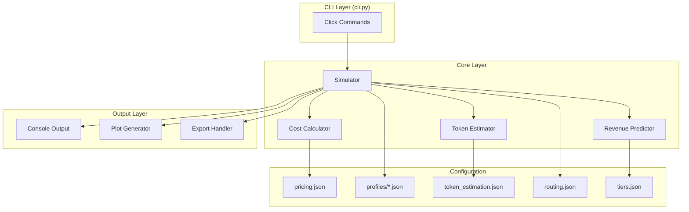

# Design Document: LLM Cost Predictor

## Overview

The LLM Cost Predictor is a Python CLI tool that uses Monte Carlo simulation to predict operational costs and revenue for multi-model LLM architectures. It models query routing through a classifier to specialized lead models, with delegation capabilities, caching, error handling, and user tier differentiation.

The tool provides four main commands:
- `simulate` - Run Monte Carlo simulation for a single profile
- `compare` - Compare multiple profiles side-by-side
- `sensitivity` - Analyze parameter impact on costs
- `forecast` - Project costs/revenue over time with growth

## Architecturec




## Components and Interfaces

### 1. CLI Module (`cli.py`)

The entry point using Click framework. Handles argument parsing, config loading, and orchestrates simulation runs.

```python
import click
from pathlib import Path

@click.group()
@click.option('--config-dir', default='config', help='Configuration directory')
@click.pass_context
def cli(ctx, config_dir: str) -> None:
    """LLM Cost Predictor - Monte Carlo simulation for multi-model costs."""
    ctx.ensure_object(dict)
    ctx.obj['config_dir'] = Path(config_dir)

@cli.command()
@click.argument('profile')
@click.option('--iterations', '-n', default=10000, help='Number of simulation iterations')
@click.option('--seed', type=int, help='Random seed for reproducibility')
@click.option('--output-dir', default='output', help='Output directory for plots')
@click.option('--no-plot', is_flag=True, help='Skip plot generation')
@click.option('--export', type=click.Path(), help='Export results to JSON')
@click.option('--export-csv', type=click.Path(), help='Export summary to CSV')
@click.option('--budget', type=float, help='Daily budget constraint')
@click.pass_context
def simulate(ctx, profile: str, iterations: int, seed: int | None, 
             output_dir: str, no_plot: bool, export: str | None,
             export_csv: str | None, budget: float | None) -> None:
    """Run Monte Carlo simulation with a profile."""
    pass

@cli.command()
@click.argument('profiles', nargs=-1, required=True)
@click.option('--iterations', '-n', default=10000)
@click.option('--output-dir', default='output')
@click.pass_context
def compare(ctx, profiles: tuple[str, ...], iterations: int, output_dir: str) -> None:
    """Compare multiple profiles side-by-side."""
    pass

@cli.command()
@click.argument('profile')
@click.option('--parameter', '-p', required=True, 
              type=click.Choice(['routing_accuracy', 'daily_volume', 
                                'delegation_probability', 'cache_hit_rate', 'budget']))
@click.option('--min-value', type=float, required=True)
@click.option('--max-value', type=float, required=True)
@click.option('--steps', default=10)
@click.option('--iterations', '-n', default=5000)
@click.pass_context
def sensitivity(ctx, profile: str, parameter: str, min_value: float,
                max_value: float, steps: int, iterations: int) -> None:
    """Run sensitivity analysis on a parameter."""
    pass

@cli.command()
@click.argument('profile')
@click.option('--months', '-m', default=12, help='Number of months to forecast')
@click.option('--iterations', '-n', default=10000)
@click.option('--output-dir', default='output')
@click.pass_context
def forecast(ctx, profile: str, months: int, iterations: int, output_dir: str) -> None:
    """Project costs and revenue over time with user growth."""
    pass

@cli.command('import')
@click.argument('logfile', type=click.Path(exists=True))
@click.option('--output', '-o', required=True, help='Output profile name')
@click.pass_context
def import_logs(ctx, logfile: str, output: str) -> None:
    """Import historical usage logs to create a profile."""
    pass

@cli.command()
@click.argument('batch_config', type=click.Path(exists=True))
@click.option('--parallel', '-j', default=1, help='Parallel workers')
@click.pass_context
def batch(ctx, batch_config: str, parallel: int) -> None:
    """Run multiple simulations from a batch config."""
    pass
```


### 2. Types Module (`core/types.py`)

Defines all data structures using dataclasses and enums.

```python
from dataclasses import dataclass, field
from enum import Enum
from typing import Optional
import json

class QueryType(Enum):
    VISUAL = "visual"
    CODE = "code"
    RESEARCH = "research"

class Complexity(Enum):
    SIMPLE = "simple"
    MODERATE = "moderate"
    COMPLEX = "complex"

class UserTier(Enum):
    FREE = "free"
    PAID = "paid"
    ENTERPRISE = "enterprise"

@dataclass
class ModelPricing:
    name: str
    input_price_per_1k: float  # USD per 1000 tokens
    output_price_per_1k: float
    cached_input_price_per_1k: float
    latency_ms_avg: float
    availability_rate: float = 0.999

@dataclass
class TokenEstimate:
    input_tokens: int
    output_tokens: int

@dataclass
class QuerySimulation:
    query_type: QueryType
    complexity: Complexity
    user_tier: UserTier
    routed_to: str
    correct_route: bool
    delegated: bool
    delegation_chain: list[str]
    tokens: TokenEstimate
    cache_hit: bool
    error_occurred: bool
    retry_count: int
    cost_usd: float
    latency_ms: float

@dataclass
class CostBreakdown:
    routing_cost: float
    lead_model_cost: float
    delegation_cost: float
    retry_cost: float
    total_cost: float

@dataclass
class TierConfig:
    name: UserTier
    daily_query_limit: int | None
    allowed_complexity: list[Complexity]
    subscription_fee_monthly: float
    growth_rate_monthly: float

@dataclass
class Profile:
    name: str
    daily_volume: int
    query_mix: dict[QueryType, float]  # Probabilities summing to 1.0
    complexity_distribution: dict[Complexity, float]
    routing_accuracy: float
    delegation_probability: float
    cache_hit_rate: float
    error_rate: float
    tier_distribution: dict[UserTier, float]
    user_counts: dict[UserTier, int]

@dataclass
class SimulationResult:
    profile_name: str
    iterations: int
    seed: int
    daily_costs: list[float]
    cost_breakdown: CostBreakdown
    mean_cost: float
    p50_cost: float
    p95_cost: float
    p99_cost: float
    total_revenue: float
    profit_margin: float
    rejection_rate: float
    avg_latency_ms: float
    cache_savings: float

    def to_json(self) -> str:
        """Serialize to JSON string."""
        pass

    @classmethod
    def from_json(cls, json_str: str) -> 'SimulationResult':
        """Deserialize from JSON string."""
        pass
```


### 3. Simulator Module (`core/simulator.py`)

The Monte Carlo simulation engine.

```python
import numpy as np
from numpy.random import Generator
from .types import (Profile, SimulationResult, QuerySimulation, 
                    QueryType, Complexity, UserTier, CostBreakdown)
from .cost_calculator import CostCalculator
from .token_estimator import TokenEstimator

class Simulator:
    def __init__(self, 
                 cost_calculator: CostCalculator,
                 token_estimator: TokenEstimator,
                 routing_config: dict,
                 tier_configs: dict[UserTier, TierConfig]):
        self.cost_calculator = cost_calculator
        self.token_estimator = token_estimator
        self.routing_config = routing_config
        self.tier_configs = tier_configs

    def run(self, profile: Profile, iterations: int, 
            seed: int | None = None, budget: float | None = None) -> SimulationResult:
        """Run Monte Carlo simulation for the given profile."""
        rng = np.random.default_rng(seed)
        actual_seed = seed if seed is not None else rng.integers(0, 2**31)
        
        daily_costs = []
        all_queries = []
        rejected_count = 0
        
        for _ in range(iterations):
            day_cost, day_queries, day_rejected = self._simulate_day(
                profile, rng, budget
            )
            daily_costs.append(day_cost)
            all_queries.extend(day_queries)
            rejected_count += day_rejected
        
        return self._aggregate_results(
            profile, iterations, actual_seed, daily_costs, all_queries, rejected_count
        )

    def _simulate_day(self, profile: Profile, rng: Generator, 
                      budget: float | None) -> tuple[float, list[QuerySimulation], int]:
        """Simulate one day of queries."""
        queries = []
        total_cost = 0.0
        rejected = 0
        
        for _ in range(profile.daily_volume):
            query = self._simulate_query(profile, rng)
            
            if budget is not None and total_cost + query.cost_usd > budget:
                rejected += 1
                continue
                
            queries.append(query)
            total_cost += query.cost_usd
        
        return total_cost, queries, rejected

    def _simulate_query(self, profile: Profile, rng: Generator) -> QuerySimulation:
        """Simulate a single query through the routing system."""
        # Sample user tier
        tier = self._sample_tier(profile, rng)
        
        # Check tier limits
        tier_config = self.tier_configs.get(tier)
        
        # Sample query type and complexity
        query_type = self._sample_query_type(profile, rng)
        complexity = self._sample_complexity(profile, rng, tier_config)
        
        # Determine routing
        correct_route = rng.random() < profile.routing_accuracy
        routed_to = self._get_route(query_type, correct_route, rng)
        
        # Determine delegation
        delegated = (complexity == Complexity.COMPLEX and 
                    rng.random() < profile.delegation_probability)
        delegation_chain = self._build_delegation_chain(routed_to, delegated, rng)
        
        # Check cache hit
        cache_hit = rng.random() < profile.cache_hit_rate
        
        # Check for errors and retries
        error_occurred, retry_count = self._simulate_errors(profile, rng)
        
        # Estimate tokens
        tokens = self.token_estimator.estimate(query_type, complexity, delegated)
        
        # Calculate cost
        cost = self.cost_calculator.calculate(
            delegation_chain, tokens, cache_hit, retry_count
        )
        
        # Estimate latency
        latency = self.cost_calculator.estimate_latency(delegation_chain)
        
        return QuerySimulation(
            query_type=query_type,
            complexity=complexity,
            user_tier=tier,
            routed_to=routed_to,
            correct_route=correct_route,
            delegated=delegated,
            delegation_chain=delegation_chain,
            tokens=tokens,
            cache_hit=cache_hit,
            error_occurred=error_occurred,
            retry_count=retry_count,
            cost_usd=cost,
            latency_ms=latency
        )

    def _sample_tier(self, profile: Profile, rng: Generator) -> UserTier:
        """Sample user tier based on distribution."""
        tiers = list(profile.tier_distribution.keys())
        probs = list(profile.tier_distribution.values())
        return rng.choice(tiers, p=probs)

    def _sample_query_type(self, profile: Profile, rng: Generator) -> QueryType:
        """Sample query type based on mix distribution."""
        types = list(profile.query_mix.keys())
        probs = list(profile.query_mix.values())
        return rng.choice(types, p=probs)

    def _sample_complexity(self, profile: Profile, rng: Generator,
                          tier_config: TierConfig | None) -> Complexity:
        """Sample complexity, respecting tier restrictions."""
        allowed = tier_config.allowed_complexity if tier_config else list(Complexity)
        dist = {k: v for k, v in profile.complexity_distribution.items() if k in allowed}
        # Renormalize
        total = sum(dist.values())
        probs = [v/total for v in dist.values()]
        return rng.choice(list(dist.keys()), p=probs)

    def _get_route(self, query_type: QueryType, correct: bool, 
                   rng: Generator) -> str:
        """Get the routed model name."""
        correct_routes = {
            QueryType.VISUAL: "gemini",
            QueryType.CODE: "coder", 
            QueryType.RESEARCH: "grok"
        }
        if correct:
            return correct_routes[query_type]
        # Pick wrong route
        wrong_routes = [r for r in correct_routes.values() 
                       if r != correct_routes[query_type]]
        return rng.choice(wrong_routes)

    def _build_delegation_chain(self, lead_model: str, delegated: bool,
                                rng: Generator) -> list[str]:
        """Build the full delegation chain including classifier."""
        chain = ["classifier", lead_model]
        if delegated:
            fallbacks = self.routing_config.get("fallback_chains", {})
            if lead_model in fallbacks:
                chain.append(rng.choice(fallbacks[lead_model]))
        return chain

    def _simulate_errors(self, profile: Profile, 
                        rng: Generator) -> tuple[bool, int]:
        """Simulate error occurrence and retries."""
        error = rng.random() < profile.error_rate
        retries = 0
        if error:
            # Retry up to 3 times
            for _ in range(3):
                retries += 1
                if rng.random() >= profile.error_rate:
                    break
        return error, retries

    def _aggregate_results(self, profile: Profile, iterations: int, seed: int,
                          daily_costs: list[float], queries: list[QuerySimulation],
                          rejected: int) -> SimulationResult:
        """Aggregate simulation results into statistics."""
        costs_array = np.array(daily_costs)
        
        # Calculate cost breakdown
        routing_cost = sum(q.cost_usd for q in queries if len(q.delegation_chain) == 2)
        delegation_cost = sum(q.cost_usd for q in queries if q.delegated)
        retry_cost = sum(q.cost_usd * q.retry_count / (q.retry_count + 1) 
                        for q in queries if q.retry_count > 0)
        
        breakdown = CostBreakdown(
            routing_cost=routing_cost / iterations,
            lead_model_cost=(sum(q.cost_usd for q in queries) - delegation_cost) / iterations,
            delegation_cost=delegation_cost / iterations,
            retry_cost=retry_cost / iterations,
            total_cost=float(costs_array.mean())
        )
        
        # Calculate revenue
        revenue = sum(
            profile.user_counts.get(tier, 0) * self.tier_configs[tier].subscription_fee_monthly / 30
            for tier in UserTier
        )
        
        profit_margin = (revenue - breakdown.total_cost) / revenue if revenue > 0 else 0
        
        # Cache savings
        cache_savings = sum(q.cost_usd * 0.5 for q in queries if q.cache_hit) / iterations
        
        return SimulationResult(
            profile_name=profile.name,
            iterations=iterations,
            seed=seed,
            daily_costs=daily_costs,
            cost_breakdown=breakdown,
            mean_cost=float(costs_array.mean()),
            p50_cost=float(np.percentile(costs_array, 50)),
            p95_cost=float(np.percentile(costs_array, 95)),
            p99_cost=float(np.percentile(costs_array, 99)),
            total_revenue=revenue,
            profit_margin=profit_margin,
            rejection_rate=rejected / (profile.daily_volume * iterations),
            avg_latency_ms=float(np.mean([q.latency_ms for q in queries])),
            cache_savings=cache_savings
        )
```


### 4. Cost Calculator Module (`core/cost_calculator.py`)

Handles cost computation based on token usage and model pricing.

```python
from .types import ModelPricing, TokenEstimate

class CostCalculator:
    def __init__(self, pricing_config: dict[str, ModelPricing]):
        self.pricing = pricing_config

    def calculate(self, delegation_chain: list[str], tokens: TokenEstimate,
                  cache_hit: bool, retry_count: int) -> float:
        """Calculate total cost for a query through the delegation chain."""
        total_cost = 0.0
        
        for model_name in delegation_chain:
            pricing = self.pricing.get(model_name)
            if not pricing:
                continue
            
            input_price = (pricing.cached_input_price_per_1k if cache_hit 
                          else pricing.input_price_per_1k)
            
            model_cost = (
                (tokens.input_tokens / 1000) * input_price +
                (tokens.output_tokens / 1000) * pricing.output_price_per_1k
            )
            total_cost += model_cost
        
        # Add retry costs (each retry incurs full cost)
        total_cost *= (1 + retry_count)
        
        return total_cost

    def estimate_latency(self, delegation_chain: list[str]) -> float:
        """Estimate total latency for the delegation chain."""
        total_latency = 0.0
        for model_name in delegation_chain:
            pricing = self.pricing.get(model_name)
            if pricing:
                total_latency += pricing.latency_ms_avg
        return total_latency

    def calculate_break_even(self, daily_cost: float, 
                            tier_configs: dict, 
                            tier_distribution: dict) -> dict:
        """Calculate break-even user counts."""
        # Calculate weighted average revenue per user
        avg_revenue = sum(
            tier_configs[tier].subscription_fee_monthly / 30 * prob
            for tier, prob in tier_distribution.items()
        )
        
        if avg_revenue <= 0:
            return {"break_even_users": float('inf'), "achievable": False}
        
        break_even = daily_cost / avg_revenue
        return {"break_even_users": int(break_even) + 1, "achievable": True}
```

### 5. Token Estimator Module (`core/token_estimator.py`)

Estimates token counts based on query characteristics.

```python
from .types import QueryType, Complexity, TokenEstimate

class TokenEstimator:
    def __init__(self, estimation_config: dict):
        self.config = estimation_config

    def estimate(self, query_type: QueryType, complexity: Complexity,
                 delegated: bool) -> TokenEstimate:
        """Estimate input and output tokens for a query."""
        base = self.config["base_tokens"].get(query_type.value, {})
        multiplier = self.config["complexity_multipliers"].get(complexity.value, 1.0)
        
        input_tokens = int(base.get("input", 500) * multiplier)
        output_tokens = int(base.get("output", 1000) * multiplier)
        
        if delegated:
            delegation_overhead = self.config.get("delegation_overhead", 1.5)
            input_tokens = int(input_tokens * delegation_overhead)
            output_tokens = int(output_tokens * delegation_overhead)
        
        return TokenEstimate(input_tokens=input_tokens, output_tokens=output_tokens)
```


### 6. Plot Generator Module (`core/plots.py`)

Generates publication-quality visualizations.

```python
import matplotlib.pyplot as plt
import numpy as np
from pathlib import Path
from .types import SimulationResult, CostBreakdown

class PlotGenerator:
    def __init__(self, output_dir: Path, style: str = "seaborn-v0_8-whitegrid"):
        self.output_dir = output_dir
        self.output_dir.mkdir(parents=True, exist_ok=True)
        plt.style.use(style)

    def cost_distribution(self, result: SimulationResult, 
                         filename: str = "cost_distribution.png") -> Path:
        """Generate cost distribution histogram."""
        fig, ax = plt.subplots(figsize=(10, 6))
        
        ax.hist(result.daily_costs, bins=50, edgecolor='black', alpha=0.7)
        ax.axvline(result.mean_cost, color='red', linestyle='--', 
                   label=f'Mean: ${result.mean_cost:.2f}')
        ax.axvline(result.p50_cost, color='green', linestyle='--',
                   label=f'P50: ${result.p50_cost:.2f}')
        ax.axvline(result.p95_cost, color='orange', linestyle='--',
                   label=f'P95: ${result.p95_cost:.2f}')
        
        ax.set_xlabel('Daily Cost (USD)')
        ax.set_ylabel('Frequency')
        ax.set_title(f'Cost Distribution - {result.profile_name}')
        ax.legend()
        
        path = self.output_dir / filename
        fig.savefig(path, dpi=150, bbox_inches='tight')
        plt.close(fig)
        return path

    def cost_breakdown(self, result: SimulationResult,
                      filename: str = "cost_breakdown.png") -> Path:
        """Generate cost breakdown pie chart."""
        fig, ax = plt.subplots(figsize=(8, 8))
        
        breakdown = result.cost_breakdown
        labels = ['Routing', 'Lead Model', 'Delegation', 'Retries']
        sizes = [breakdown.routing_cost, breakdown.lead_model_cost,
                breakdown.delegation_cost, breakdown.retry_cost]
        colors = ['#ff9999', '#66b3ff', '#99ff99', '#ffcc99']
        
        # Filter out zero values
        non_zero = [(l, s, c) for l, s, c in zip(labels, sizes, colors) if s > 0]
        if non_zero:
            labels, sizes, colors = zip(*non_zero)
            ax.pie(sizes, labels=labels, colors=colors, autopct='%1.1f%%',
                   startangle=90)
        
        ax.set_title(f'Cost Breakdown - {result.profile_name}')
        
        path = self.output_dir / filename
        fig.savefig(path, dpi=150, bbox_inches='tight')
        plt.close(fig)
        return path

    def comparison(self, results: list[SimulationResult],
                  filename: str = "comparison.png") -> Path:
        """Generate comparison bar chart for multiple profiles."""
        fig, ax = plt.subplots(figsize=(12, 6))
        
        names = [r.profile_name for r in results]
        x = np.arange(len(names))
        width = 0.2
        
        means = [r.mean_cost for r in results]
        p50s = [r.p50_cost for r in results]
        p95s = [r.p95_cost for r in results]
        p99s = [r.p99_cost for r in results]
        
        ax.bar(x - 1.5*width, means, width, label='Mean')
        ax.bar(x - 0.5*width, p50s, width, label='P50')
        ax.bar(x + 0.5*width, p95s, width, label='P95')
        ax.bar(x + 1.5*width, p99s, width, label='P99')
        
        ax.set_xlabel('Profile')
        ax.set_ylabel('Daily Cost (USD)')
        ax.set_title('Profile Comparison')
        ax.set_xticks(x)
        ax.set_xticklabels(names)
        ax.legend()
        
        path = self.output_dir / filename
        fig.savefig(path, dpi=150, bbox_inches='tight')
        plt.close(fig)
        return path

    def sensitivity(self, param_name: str, param_values: list[float],
                   results: list[SimulationResult],
                   filename: str = "sensitivity.png") -> Path:
        """Generate sensitivity analysis chart."""
        fig, ax = plt.subplots(figsize=(10, 6))
        
        means = [r.mean_cost for r in results]
        p95s = [r.p95_cost for r in results]
        
        ax.plot(param_values, means, 'b-o', label='Mean Cost')
        ax.fill_between(param_values, 
                       [r.p50_cost for r in results],
                       p95s, alpha=0.3, label='P50-P95 Range')
        
        ax.set_xlabel(param_name.replace('_', ' ').title())
        ax.set_ylabel('Daily Cost (USD)')
        ax.set_title(f'Sensitivity Analysis: {param_name}')
        ax.legend()
        ax.grid(True, alpha=0.3)
        
        path = self.output_dir / filename
        fig.savefig(path, dpi=150, bbox_inches='tight')
        plt.close(fig)
        return path

    def forecast(self, months: list[int], costs: list[float], 
                revenues: list[float], profits: list[float],
                filename: str = "forecast.png") -> Path:
        """Generate forecast time series chart."""
        fig, (ax1, ax2) = plt.subplots(2, 1, figsize=(12, 10), sharex=True)
        
        ax1.plot(months, costs, 'r-o', label='Monthly Cost')
        ax1.plot(months, revenues, 'g-o', label='Monthly Revenue')
        ax1.set_ylabel('USD')
        ax1.set_title('Cost and Revenue Forecast')
        ax1.legend()
        ax1.grid(True, alpha=0.3)
        
        ax2.bar(months, profits, color=['green' if p > 0 else 'red' for p in profits])
        ax2.axhline(0, color='black', linewidth=0.5)
        ax2.set_xlabel('Month')
        ax2.set_ylabel('Profit (USD)')
        ax2.set_title('Monthly Profit')
        ax2.grid(True, alpha=0.3)
        
        path = self.output_dir / filename
        fig.savefig(path, dpi=150, bbox_inches='tight')
        plt.close(fig)
        return path
```


### 7. Config Loader Module (`core/config.py`)

Handles loading and validating JSON configuration files.

```python
import json
from pathlib import Path
from .types import Profile, ModelPricing, TierConfig, QueryType, Complexity, UserTier

class ConfigLoader:
    def __init__(self, config_dir: Path):
        self.config_dir = config_dir

    def load_pricing(self) -> dict[str, ModelPricing]:
        """Load model pricing configuration."""
        path = self.config_dir / "pricing.json"
        data = self._load_json(path)
        return {
            name: ModelPricing(
                name=name,
                input_price_per_1k=cfg["input_price_per_1k"],
                output_price_per_1k=cfg["output_price_per_1k"],
                cached_input_price_per_1k=cfg.get("cached_input_price_per_1k", 
                                                   cfg["input_price_per_1k"] * 0.5),
                latency_ms_avg=cfg.get("latency_ms_avg", 1000),
                availability_rate=cfg.get("availability_rate", 0.999)
            )
            for name, cfg in data["models"].items()
        }

    def load_profile(self, name: str) -> Profile:
        """Load a usage profile."""
        path = self.config_dir / "profiles" / f"{name}.json"
        data = self._load_json(path)
        return Profile(
            name=data["name"],
            daily_volume=data["daily_volume"],
            query_mix={QueryType(k): v for k, v in data["query_mix"].items()},
            complexity_distribution={Complexity(k): v 
                                    for k, v in data["complexity_distribution"].items()},
            routing_accuracy=data["routing_accuracy"],
            delegation_probability=data["delegation_probability"],
            cache_hit_rate=data.get("cache_hit_rate", 0.0),
            error_rate=data.get("error_rate", 0.01),
            tier_distribution={UserTier(k): v 
                              for k, v in data.get("tier_distribution", 
                                                   {"free": 0.8, "paid": 0.2}).items()},
            user_counts={UserTier(k): v 
                        for k, v in data.get("user_counts", 
                                            {"free": 1000, "paid": 100}).items()}
        )

    def load_token_estimation(self) -> dict:
        """Load token estimation rules."""
        path = self.config_dir / "token_estimation.json"
        return self._load_json(path)

    def load_routing(self) -> dict:
        """Load routing configuration."""
        path = self.config_dir / "routing.json"
        return self._load_json(path)

    def load_tiers(self) -> dict[UserTier, TierConfig]:
        """Load tier configurations."""
        path = self.config_dir / "tiers.json"
        data = self._load_json(path)
        return {
            UserTier(name): TierConfig(
                name=UserTier(name),
                daily_query_limit=cfg.get("daily_query_limit"),
                allowed_complexity=[Complexity(c) for c in cfg.get("allowed_complexity", 
                                                                   ["simple", "moderate", "complex"])],
                subscription_fee_monthly=cfg.get("subscription_fee_monthly", 0),
                growth_rate_monthly=cfg.get("growth_rate_monthly", 0.0)
            )
            for name, cfg in data["tiers"].items()
        }

    def _load_json(self, path: Path) -> dict:
        """Load and parse a JSON file."""
        if not path.exists():
            raise FileNotFoundError(f"Configuration file not found: {path}")
        try:
            with open(path) as f:
                return json.load(f)
        except json.JSONDecodeError as e:
            raise ValueError(f"Invalid JSON in {path}: {e}")
```

### 8. Log Importer Module (`core/importer.py`)

Imports historical usage logs to create profiles.

```python
import json
from pathlib import Path
from collections import Counter
from .types import QueryType, Complexity

class LogImporter:
    def import_logs(self, logfile: Path) -> dict:
        """Parse log file and generate profile configuration."""
        logs = self._parse_logs(logfile)
        
        # Calculate distributions
        query_types = Counter(log["query_type"] for log in logs)
        complexities = Counter(log["complexity"] for log in logs)
        
        total_queries = len(logs)
        correct_routes = sum(1 for log in logs if log.get("correct_route", True))
        delegated = sum(1 for log in logs if log.get("delegated", False))
        cache_hits = sum(1 for log in logs if log.get("cache_hit", False))
        errors = sum(1 for log in logs if log.get("error_occurred", False))
        
        return {
            "name": "imported_profile",
            "daily_volume": total_queries,
            "query_mix": {k: v/total_queries for k, v in query_types.items()},
            "complexity_distribution": {k: v/total_queries for k, v in complexities.items()},
            "routing_accuracy": correct_routes / total_queries if total_queries > 0 else 0.95,
            "delegation_probability": delegated / total_queries if total_queries > 0 else 0.1,
            "cache_hit_rate": cache_hits / total_queries if total_queries > 0 else 0.0,
            "error_rate": errors / total_queries if total_queries > 0 else 0.01,
            "tier_distribution": {"free": 0.8, "paid": 0.2},
            "user_counts": {"free": 1000, "paid": 100}
        }

    def _parse_logs(self, logfile: Path) -> list[dict]:
        """Parse JSON log entries (one per line or array)."""
        logs = []
        with open(logfile) as f:
            content = f.read().strip()
            if content.startswith('['):
                logs = json.loads(content)
            else:
                for line in content.split('\n'):
                    if line.strip():
                        logs.append(json.loads(line))
        return logs
```


## Data Models

### Configuration File Schemas

#### pricing.json
```json
{
  "models": {
    "classifier": {
      "input_price_per_1k": 0.0001,
      "output_price_per_1k": 0.0002,
      "cached_input_price_per_1k": 0.00005,
      "latency_ms_avg": 100,
      "availability_rate": 0.999
    },
    "gemini": {
      "input_price_per_1k": 0.001,
      "output_price_per_1k": 0.002,
      "cached_input_price_per_1k": 0.0005,
      "latency_ms_avg": 500,
      "availability_rate": 0.998
    },
    "coder": {
      "input_price_per_1k": 0.003,
      "output_price_per_1k": 0.015,
      "cached_input_price_per_1k": 0.0015,
      "latency_ms_avg": 800,
      "availability_rate": 0.997
    },
    "grok": {
      "input_price_per_1k": 0.002,
      "output_price_per_1k": 0.006,
      "cached_input_price_per_1k": 0.001,
      "latency_ms_avg": 600,
      "availability_rate": 0.998
    }
  }
}
```

#### profiles/default.json
```json
{
  "name": "default",
  "daily_volume": 10000,
  "query_mix": {
    "visual": 0.2,
    "code": 0.5,
    "research": 0.3
  },
  "complexity_distribution": {
    "simple": 0.6,
    "moderate": 0.3,
    "complex": 0.1
  },
  "routing_accuracy": 0.95,
  "delegation_probability": 0.15,
  "cache_hit_rate": 0.2,
  "error_rate": 0.01,
  "tier_distribution": {
    "free": 0.7,
    "paid": 0.25,
    "enterprise": 0.05
  },
  "user_counts": {
    "free": 5000,
    "paid": 1000,
    "enterprise": 50
  }
}
```

#### token_estimation.json
```json
{
  "base_tokens": {
    "visual": {"input": 1000, "output": 500},
    "code": {"input": 800, "output": 2000},
    "research": {"input": 500, "output": 1500}
  },
  "complexity_multipliers": {
    "simple": 0.5,
    "moderate": 1.0,
    "complex": 2.5
  },
  "delegation_overhead": 1.5
}
```

#### routing.json
```json
{
  "correct_routes": {
    "visual": "gemini",
    "code": "coder",
    "research": "grok"
  },
  "fallback_chains": {
    "gemini": ["coder", "grok"],
    "coder": ["grok", "gemini"],
    "grok": ["coder", "gemini"]
  },
  "delegation_targets": {
    "gemini": ["coder"],
    "coder": ["grok"],
    "grok": ["coder"]
  }
}
```

#### tiers.json
```json
{
  "tiers": {
    "free": {
      "daily_query_limit": 50,
      "allowed_complexity": ["simple", "moderate"],
      "subscription_fee_monthly": 0,
      "growth_rate_monthly": 0.1
    },
    "paid": {
      "daily_query_limit": 500,
      "allowed_complexity": ["simple", "moderate", "complex"],
      "subscription_fee_monthly": 20,
      "growth_rate_monthly": 0.05
    },
    "enterprise": {
      "daily_query_limit": null,
      "allowed_complexity": ["simple", "moderate", "complex"],
      "subscription_fee_monthly": 200,
      "growth_rate_monthly": 0.02
    }
  }
}
```


## Correctness Properties

*A property is a characteristic or behavior that should hold true across all valid executions of a system—essentially, a formal statement about what the system should do. Properties serve as the bridge between human-readable specifications and machine-verifiable correctness guarantees.*

### Property 1: Iteration Count Consistency
*For any* simulation run with a specified iteration count N, the resulting `daily_costs` array SHALL contain exactly N elements.
**Validates: Requirements 1.1, 4.3**

### Property 2: Query Type Distribution Convergence
*For any* profile with a query_mix distribution, over a large number of simulated queries (≥10,000), the observed query type frequencies SHALL converge to the configured distribution within statistical tolerance (chi-squared test p > 0.01).
**Validates: Requirements 1.2**

### Property 3: Complexity Distribution Convergence
*For any* profile with a complexity_distribution, over a large number of simulated queries, the observed complexity frequencies SHALL converge to the configured distribution within statistical tolerance.
**Validates: Requirements 1.3**

### Property 4: Routing Accuracy Convergence
*For any* profile with a routing_accuracy parameter, the fraction of correctly routed queries SHALL converge to the configured accuracy within statistical tolerance.
**Validates: Requirements 1.4**

### Property 5: Incorrect Routing Cost Penalty
*For any* query that is incorrectly routed, the model used for cost calculation SHALL differ from the correct route model, and the cost SHALL be computed using the incorrectly routed model's pricing.
**Validates: Requirements 1.5, 3.3**

### Property 6: Delegation Probability Convergence
*For any* profile with complex queries and a delegation_probability, the fraction of delegated complex queries SHALL converge to the configured probability within statistical tolerance.
**Validates: Requirements 1.6**

### Property 7: Delegation Chain Cost Inclusion
*For any* delegated query, the total cost SHALL include costs from all models in the delegation chain (classifier + lead model + delegation target).
**Validates: Requirements 1.7, 3.4**

### Property 8: Statistics Calculation Correctness
*For any* simulation result with daily_costs array, the mean_cost SHALL equal np.mean(daily_costs), p50_cost SHALL equal np.percentile(daily_costs, 50), p95_cost SHALL equal np.percentile(daily_costs, 95), and p99_cost SHALL equal np.percentile(daily_costs, 99).
**Validates: Requirements 1.8**

### Property 9: Token Estimation by Query Type
*For any* two queries with different query types but same complexity and delegation status, the token estimates SHALL differ according to the base_tokens configuration.
**Validates: Requirements 2.1**

### Property 10: Complexity Multiplier Application
*For any* query type, tokens estimated for "complex" queries SHALL be greater than "moderate" which SHALL be greater than "simple", by the configured multiplier ratios.
**Validates: Requirements 2.2**

### Property 11: Delegation Token Overhead
*For any* query, if delegation occurs, the token estimate SHALL be multiplied by the delegation_overhead factor compared to the same query without delegation.
**Validates: Requirements 2.3**

### Property 12: Cost Formula Correctness
*For any* query with known tokens and model pricing, the calculated cost SHALL equal: (input_tokens / 1000 × input_price_per_1k) + (output_tokens / 1000 × output_price_per_1k).
**Validates: Requirements 3.2**

### Property 13: Dataclass Round-Trip Serialization
*For any* valid SimulationResult, Profile, or CostBreakdown instance, serializing to JSON then deserializing SHALL produce an object equivalent to the original.
**Validates: Requirements 9.4**

### Property 14: Log Import Distribution Accuracy
*For any* log file with N entries, the imported profile's query_mix and complexity_distribution SHALL reflect the actual frequencies in the log data, with each probability summing to 1.0.
**Validates: Requirements 10.2, 10.3**

### Property 15: Seed Determinism
*For any* profile and seed value, running the simulation twice with the same seed SHALL produce identical daily_costs arrays.
**Validates: Requirements 11.1, 11.2**

### Property 16: Export Completeness
*For any* exported JSON result, the file SHALL contain: profile_name, iterations, seed, daily_costs array, mean_cost, p50_cost, p95_cost, p99_cost, and cost_breakdown.
**Validates: Requirements 12.2**

### Property 17: Tier Distribution Convergence
*For any* profile with a tier_distribution, over many simulated queries, the observed user tier frequencies SHALL converge to the configured distribution.
**Validates: Requirements 13.2**

### Property 18: Tier Usage Limits
*For any* free tier user, queries SHALL be limited to allowed_complexity levels defined in the tier config, and complex queries SHALL be rejected or downgraded.
**Validates: Requirements 13.3, 13.4**

### Property 19: Revenue Calculation Correctness
*For any* simulation with user_counts and tier subscription fees, total_revenue SHALL equal the sum of (user_count × subscription_fee_monthly / 30) for each tier.
**Validates: Requirements 14.2**

### Property 20: Profit Margin Calculation
*For any* simulation result with revenue > 0, profit_margin SHALL equal (total_revenue - mean_cost) / total_revenue.
**Validates: Requirements 14.4**

### Property 21: Break-Even Calculation
*For any* daily cost and tier configuration, the break-even user count SHALL be the minimum number of users where revenue ≥ cost.
**Validates: Requirements 14.5**

### Property 22: Growth Rate Application
*For any* forecast over N months, user counts in month M SHALL equal initial_count × (1 + growth_rate)^M for each tier.
**Validates: Requirements 15.2**

### Property 23: Caching Cost Reduction
*For any* query with cache_hit=True, the input token cost SHALL use cached_input_price_per_1k instead of input_price_per_1k, resulting in lower total cost.
**Validates: Requirements 17.2, 17.3**

### Property 24: Retry Cost Inclusion
*For any* query with retry_count > 0, the total cost SHALL be multiplied by (1 + retry_count) to account for wasted tokens on failed attempts.
**Validates: Requirements 18.2, 18.4**

### Property 25: Latency Calculation
*For any* delegation chain, the estimated latency SHALL equal the sum of latency_ms_avg for each model in the chain.
**Validates: Requirements 19.1**

### Property 26: Budget Constraint Enforcement
*For any* simulation with a budget constraint, no single day's total cost SHALL exceed the budget, and queries that would exceed the budget SHALL be rejected (increasing rejection_rate).
**Validates: Requirements 20.1, 20.2**

### Property 27: Fallback Chain Activation
*For any* model with availability_rate < 1.0, when the model is unavailable, the query SHALL be routed to the first available model in the fallback_chain.
**Validates: Requirements 21.2**


## Error Handling

### Configuration Errors
- **Missing config file**: Raise `FileNotFoundError` with descriptive message including expected path
- **Invalid JSON**: Raise `ValueError` with parse error details and line number
- **Missing required fields**: Raise `ValueError` listing missing fields
- **Invalid probability distributions**: Raise `ValueError` if probabilities don't sum to 1.0 (within tolerance)

### Runtime Errors
- **Profile not found**: Exit with code 1, display available profiles
- **Invalid parameter value**: Exit with code 1, display valid range
- **Division by zero in calculations**: Handle gracefully (e.g., profit_margin = 0 when revenue = 0)

### Simulation Errors
- **Empty profile**: Raise `ValueError` if daily_volume is 0
- **Invalid tier configuration**: Raise `ValueError` if tier limits are inconsistent

## Testing Strategy

### Unit Tests
Unit tests verify specific examples and edge cases:
- Config loading with valid/invalid files
- Token estimation for each query type and complexity
- Cost calculation with known inputs
- Statistics calculation with known arrays
- CLI argument parsing

### Property-Based Tests (Hypothesis)
Property tests verify universal properties across randomized inputs. Each property test:
- Runs minimum 100 iterations
- References the design document property number
- Uses Hypothesis strategies for generating valid inputs

**Test Configuration**:
```python
from hypothesis import given, settings, strategies as st

# Example property test structure
@settings(max_examples=100)
@given(
    iterations=st.integers(min_value=100, max_value=10000),
    seed=st.integers(min_value=0, max_value=2**31-1)
)
def test_iteration_count_consistency(iterations: int, seed: int):
    """
    Feature: llm-cost-predictor, Property 1: Iteration Count Consistency
    For any simulation run with iteration count N, daily_costs has N elements.
    """
    # Test implementation
    pass
```

**Property Test Coverage**:
| Property | Test File | Strategy |
|----------|-----------|----------|
| 1. Iteration Count | test_simulator.py | integers for iterations |
| 2-4. Distribution Convergence | test_simulator.py | floats for probabilities |
| 5. Routing Penalty | test_cost_calculator.py | query types, routing outcomes |
| 8. Statistics | test_simulator.py | lists of floats |
| 12. Cost Formula | test_cost_calculator.py | integers for tokens, floats for prices |
| 13. Round-Trip | test_types.py | builds for dataclasses |
| 15. Seed Determinism | test_simulator.py | integers for seeds |
| 23. Caching | test_cost_calculator.py | booleans for cache_hit |
| 24. Retry Cost | test_cost_calculator.py | integers for retry_count |
| 26. Budget | test_simulator.py | floats for budget |

### Integration Tests
- End-to-end CLI command execution
- Plot file generation verification
- Export file format validation
